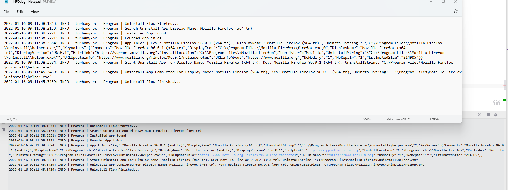

# WindowsAppUninstaller

Simple Windows App Uninstaller Console App work with "AppDisplayName" > "UninstallString" data.

#### Projects
* AppUnistaller > .Net Core version (.Net 6)
* AppUnistallerNetFramework > .Net Framework version (.Net Framework 4.8)

#### Usage
* Must be run as "Run as Administrator"
* Un install app configuration
  * For .Net Core in "config.json" > "AppDisplayName"
  * For .Net Framework in "App.json" > "AppDisplayName"
* All flow is logged

#### Sample Logs

 
